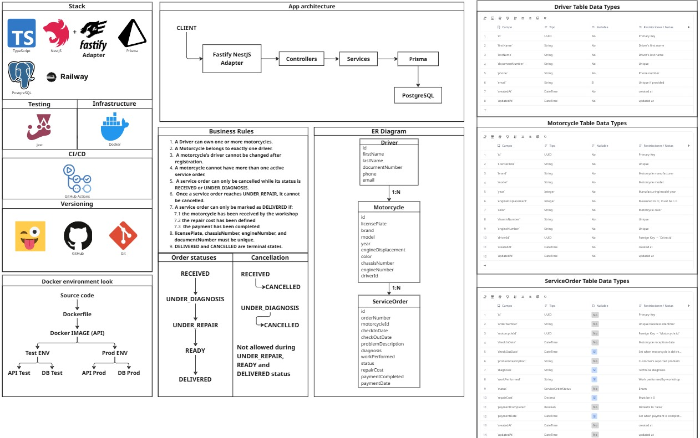

<div align="center">

# 🏍️ Motorcycle Workshop API

**RESTful API for managing a motorcycle repair workshop** — drivers, their motorcycles, and the service orders opened for each repair.

[](https://github.com/BasHdezDev/motorcycle-workshop-api/actions/workflows/production.yml)
[](https://github.com/BasHdezDev/motorcycle-workshop-api/actions/workflows/testing.yml)
[](https://github.com/BasHdezDev/motorcycle-workshop-api/releases)
[](#)

</div>

---

## 🧭 Planning Board

The full architecture, business rules, ER diagram, and data types were planned before writing any code. You can explore the interactive board here:

**🔗 [View the Miro planning board](https://miro.com/app/board/uXjVHx37ckw=/?share_link_id=623223523014)**



---

## 🛠️ Tech Stack

<div align="center">

| Layer | Technology |
|---|---|
| Language |  |
| Framework |  (Fastify adapter) |
| ORM |  |
| Database |  |
| Testing |  |
| Containerization |  |
| CI/CD |  |
| Hosting |  |

</div>

---

## 🏗️ Architecture

CLIENT → Fastify NestJS Adapter → Controllers → Services → Prisma → PostgreSQL

## 📦 Entities

| Entity | Description |
|---|---|
| `Driver` | A person who owns one or more motorcycles. |
| `Motorcycle` | Belongs to exactly one driver. |
| `ServiceOrder` | A repair/maintenance record for one motorcycle. |

**Relationships:** `Driver` 1─N `Motorcycle` 1─N `ServiceOrder`

## 📐 Business Rules

1. A driver can own one or more motorcycles.
2. A motorcycle belongs to exactly one driver.
3. A motorcycle's driver **cannot be changed** after registration.
4. A motorcycle cannot have more than one **active** service order at a time.
5. `licensePlate`, `chassisNumber`, `engineNumber`, and `documentNumber` must be unique.
6. A driver cannot be deleted while they have registered motorcycles.
7. A motorcycle cannot be deleted while it has associated service orders.

### Service Order lifecycle

RECEIVED → UNDER_DIAGNOSIS → UNDER_REPAIR → READY → DELIVERED


- Transitions only move forward, one step at a time — no skipping, no going back.
- **Cancellation** (`PATCH /service-orders/:id/cancel`) is only allowed while the order is `RECEIVED` or `UNDER_DIAGNOSIS`.
- An order can only be marked **`DELIVERED`** if `repairCost` has been set and `paymentCompleted` is `true`.
- `DELIVERED` and `CANCELLED` are **terminal states** — no further changes (status or otherwise) are allowed once an order reaches either one.
- `ServiceOrder` has no `DELETE` endpoint — deleting an order would erase repair history and break traceability. Orders are "closed" via cancellation or delivery instead.

---

## 📡 API Endpoints

All list endpoints (`GET /drivers`, `GET /motorcycles`, `GET /service-orders`) support pagination via `?page=1&limit=10` (default `page=1`, `limit=10`, max `limit=100`) and return:
```json
{
  "data": [ ... ],
  "meta": { "total": 42, "page": 1, "limit": 10, "totalPages": 5 }
}
```

All resources also support the **`QUERY`** verb for filtered search (e.g. `QUERY /drivers` with body `{"firstName":"Juan"}`).

### Drivers
| Method | Endpoint | Description |
|---|---|---|
| POST | `/drivers` | Create a driver |
| GET | `/drivers` | List drivers (paginated) |
| GET | `/drivers/:id` | Get a driver by id |
| PATCH | `/drivers/:id` | Update a driver |
| DELETE | `/drivers/:id` | Delete a driver |
| QUERY | `/drivers` | Search drivers by filters |

### Motorcycles
| Method | Endpoint | Description |
|---|---|---|
| POST | `/motorcycles` | Register a motorcycle |
| GET | `/motorcycles` | List motorcycles (paginated) |
| GET | `/motorcycles/:id` | Get a motorcycle by id |
| PATCH | `/motorcycles/:id` | Update a motorcycle |
| DELETE | `/motorcycles/:id` | Delete a motorcycle |
| QUERY | `/motorcycles` | Search motorcycles by filters |

### Service Orders
| Method | Endpoint | Description |
|---|---|---|
| POST | `/service-orders` | Open a new service order |
| GET | `/service-orders` | List service orders (paginated) |
| GET | `/service-orders/:id` | Get a service order by id |
| PATCH | `/service-orders/:id` | Update plain fields (diagnosis, cost, etc.) |
| PATCH | `/service-orders/:id/status` | Advance the order to the next status |
| PATCH | `/service-orders/:id/cancel` | Cancel an order |
| QUERY | `/service-orders` | Search orders by filters |

### Health
| Method | Endpoint | Description |
|---|---|---|
| GET | `/health` | Liveness check — verifies DB connectivity and reports app version |

---

## 🚀 Getting Started

### Prerequisites
- Node.js 22+
- Docker & Docker Compose

### Environment variables
Copy `.env.example` to `.env` and fill in the values.

### Run with Docker (recommended)
```bash
docker-compose up -d --build
```
The API will be available at `http://localhost:3000`.

### Run locally (with hot-reload)
```bash
npm install
docker-compose up -d postgres   # only the database
npm run start:dev
```

### Run tests
```bash
npm run test        # unit tests
npm run test:cov     # tests + coverage report
```

---

## 🔁 CI/CD

Two independent pipelines, each running **build → test → coverage gate → deploy → health verification**:

| Pipeline | Trigger | Coverage threshold | Deploys to |
|---|---|---|---|
| `testing.yml` | Push to any branch except `main` | ≥ 60% | Testing environment (Railway) |
| `production.yml` | Push to `main` | ≥ 85% | Production environment (Railway) |

Both pipelines stop automatically — without deploying — if the build fails, any test fails, or coverage falls below the threshold.

---

## 🌎 Live Environments

| Environment | URL |
|---|---|
| Production | `https://motorcycle-workshop-api-production.up.railway.app` |
| Testing | `https://motorcycle-workshop-api-testing.up.railway.app` |

---

## 📌 Versioning

This project follows [Semantic Versioning](https://semver.org/). See the [Releases](https://github.com/BasHdezDev/motorcycle-workshop-api/releases) page for the changelog, and `GET /health` for the version currently deployed.

## 📈 Project Status

- [x] Project setup (NestJS + Fastify + Prisma + PostgreSQL)
- [x] Docker & Docker Compose
- [x] Driver, Motorcycle & ServiceOrder CRUD
- [x] QUERY verb search endpoints
- [x] Automated tests (Jest) with coverage above rubric thresholds
- [x] CI/CD pipelines for Testing and Production
- [x] Cloud deployment (Railway)
- [x] Health check with DB connectivity verification
- [x] Unified error handling
- [x] Pagination on list endpoints
- [ ] Swagger / OpenAPI documentation